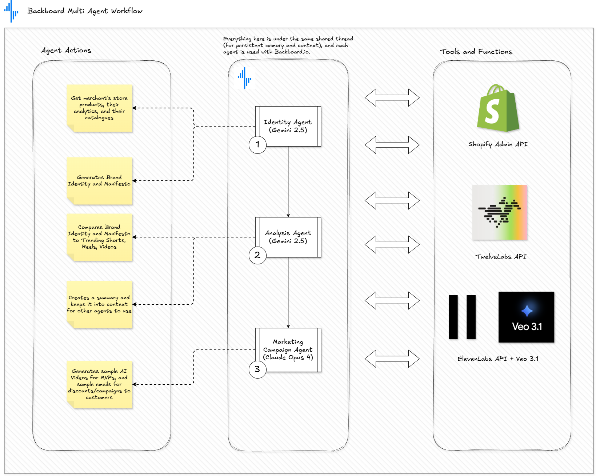
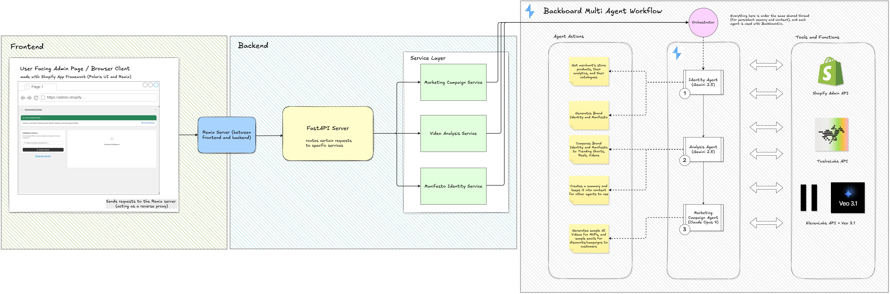

# ⛰️ ShopEcho

ShopEcho is an **agentic AI platform** designed for Shopify merchants to maintain control over how their brand appears in AI-driven commerce experiences.

---

## ✨ What ShopEcho Does

Shopecho helps Shopify merchants:

- 🛡️ **Protect** brand voice and messaging in AI interactions  
- 🎨 **Express** consistent tone, personality, and positioning  
- 📣 **Market** products through autonomous, brand-aware AI agents  

---

## 🚀 Core Features

### 🧠 Brand-Aware Multi-Agent Workflow
An intelligent multi-agent workflow that is trained on your store’s:

- Brand voice & tone guidelines
- Product catalog & descriptions
- Store policies and FAQs

This allows ShopEcho to respond, recommend, and generate content that *sounds like your brand*.

Here is a high level overview of how our agentic workflow orchestrates:



---

### 🛍️ Shopify-Native Integration
- Secure OAuth-based Shopify app
- Reads product metadata, collections, and policies
- Designed to work with emerging agentic commerce standards

---

### ✍️ AI-Powered Content & Marketing
- AI generated video content (for inspiration, marketing, MVPs, etc)
- AI generated marketing copy and campaigns
- AI generated product descriptions
- AI generated brand-safe responses for customer-facing use cases

---

### 🛠️ Tech Stack

- Shopify App Framework
- Shopify Remix + Polaris Web UI Framework
- Python + FastAPI
- LLMs (Backboard with Opus & Gemini, ElevenLabs, TwelveLabs)
- Multi-agent orchestration patterns (see [docs/designs/images/agent-workflow.png](docs/designs/images/agent-workflow.png))

Here is a high level diagram of the entire tech stack in action:



---

### 🖥️ How to Install

Install python and pip

Then run these commands:
```bash
> git clone https://github.com/andrearcaina/shopecho
> cd backend
> pip install -r requirements.txt

> cd ../frontend
> npm i
> npm run dev

# new terminal in backend folder
> uvicorn main:app --reload
```

### 🧩 Roadmap
- We plan to make it so that we have the ability to send out emails as well instead of just drafting
- We didn't have the time to add Amplitude for AI analytics and how our agents are doing
- We also plan to implement a more robust video creation to support longer times